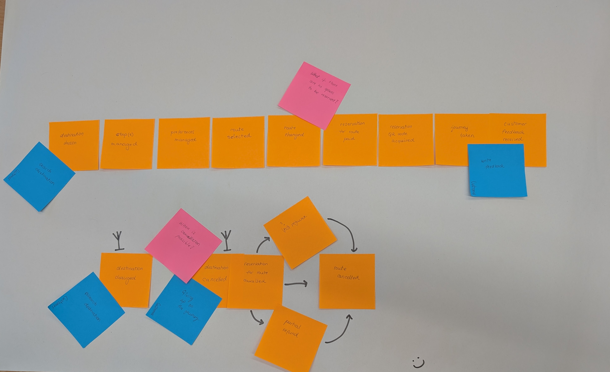

# Lightspeed_LS⚡
[](https://media.tenor.com/AkNak8NFhbMAAAAj/beating-heart.gif)

---

## Vision

> ### We live in a world where we experience needless ~~delays~~ due to never-ending ~~traffic jams~~. However, what if this could be avoided?
> 
> ---
> 
> Lightspeed [LS⚡] provides travelers a quick and easy way to search ideal routes from point A to point B. We help travelers avoid bottlenecks and steep pricing while maintaining pace and simplicity. Our app allows our users to select cost and efficiency. Additionally, we provide data analysis to local transit providers, to enhance user experience.

---

## Table of contents
- [Developers](#developers)
- [Status](#status)
- [Licensing](#licensing)
- [Event Storming](#event-storming-results)

---

## Developers:
- [Sara Alić-Ekinović](https://is.cuni.cz/studium/kdojekdo/index.php?id=3cc50146043f2df7ad0f50fb51f5ed9d&tid=&do=hledani&koho=s&fakulta=11320&prijmeni=Ali%C4%87-Ekinovi%C4%87&ch_prijmeni=0&jmeno=Sara&login=&sidos=&r_zacatek=Z&ch_diakritika=0&ch_translit=0&sustav=&stupr_mode=text&stupr=&sobor_mode=text&sims_mode=text&predm=&rozvrh=&rozvrh_stud=&sdruh=&svyjazyk=&pocet=50&vyhledej=Vyhledej)
- [Samuel Lipovský](https://is.cuni.cz/studium/kdojekdo/index.php?do=detail&si=789500)
- [Timotej Kotlín](https://is.cuni.cz/studium/kdojekdo/index.php?id=3cc50146043f2df7ad0f50fb51f5ed9d&tid=1&do=detail&si=789479)

---

## Status:
- Ongoing
- Check out our progress [here](LightSpeed.pptx)
- For more info → go to our [Wiki](https://github.com/aliekins/Lightspeed_LS/wiki)

---

## Set up Automating testig Set up

Activate virtual environment with

```
$ .\.env\Scripts\activate
```

### Whole install process

For Windows: 

```
py -m venv .env
.\.env\Scripts\activate
pip install robotframework-browser
pip list
rfbrowser init
```

---

## Licensing:
- [Public Domain License](https://wiki.creativecommons.org/wiki/public_domain)

---

## Event storming results:



